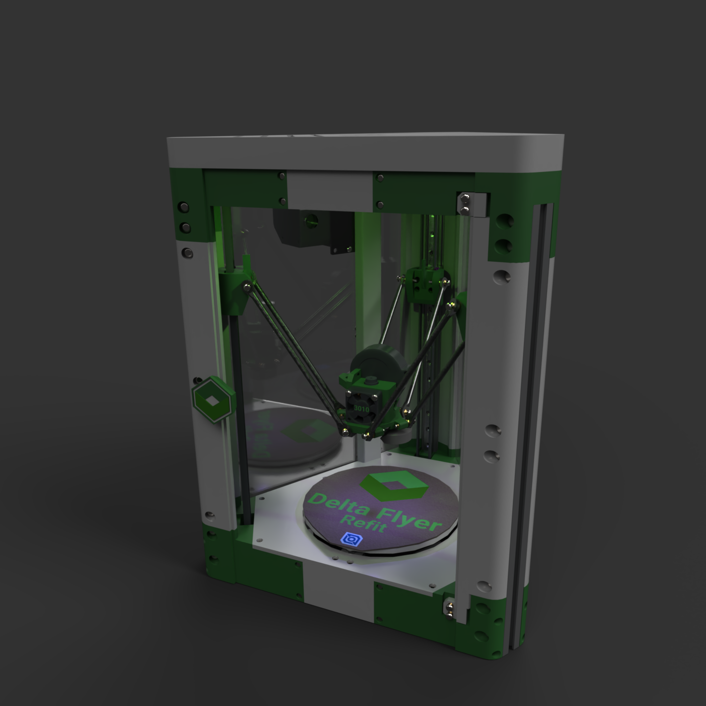

# 🚀 Delta Flyer Refit
*Where engineering meets the final frontier of 3D printing!*

## 🔧 [Build Your Own Delta Flyer on Printables!](https://www.printables.com/model/1327596-delta-flyer-refit-3d-printer)

Boldly print where no filament has gone before! This isn't just any 3D printer – it's the **Delta Flyer Refit**, a marvel of modern engineering that would make even Starfleet engineers jealous. Whether you're replicating spare parts for your own starship or just printing the perfect coffee cup, this delta-configuration beauty is ready for warp-speed printing.

> **🛠️ Ready to Build?** Head over to our [Printables page](https://www.printables.com/model/1327596-delta-flyer-refit-3d-printer) for the complete build guide, STL files, and assembly instructions. Then come back here for the essential configuration files to get your Delta Flyer operational!

Below you'll find all the essential configuration files to get your freshly-built Delta Flyer operational and printing at maximum efficiency. Each file has been carefully calibrated and tested – no red alerts here, just smooth sailing through the cosmos of creation!

## 📁 Configuration Files

### ⚙️ `Rolohaun Delta Flyer Refit - 0.4mm Nozzle.orca_printer`
Your OrcaSlicer profile, pre-configured with all the optimal settings. Just load and launch – it's that simple!

### 🖥️ `printer.cfg`
The Klipper configuration file – the brain of your Delta Flyer. Upload this to get your printer's systems online.

### 🛏️ `Delta_Flyer_Buildplate_150.stl`
A precise 3D model of your build plate for perfect slicer visualization. No more guessing where your prints will land!

### 🎨 `Delta_Flyer_Logo.png`
A sleek texture for your build plate in the slicer. Because even functional can be beautiful!

---

*Ready to engage? Download these files and prepare for printing at warp speed!* 🌟
